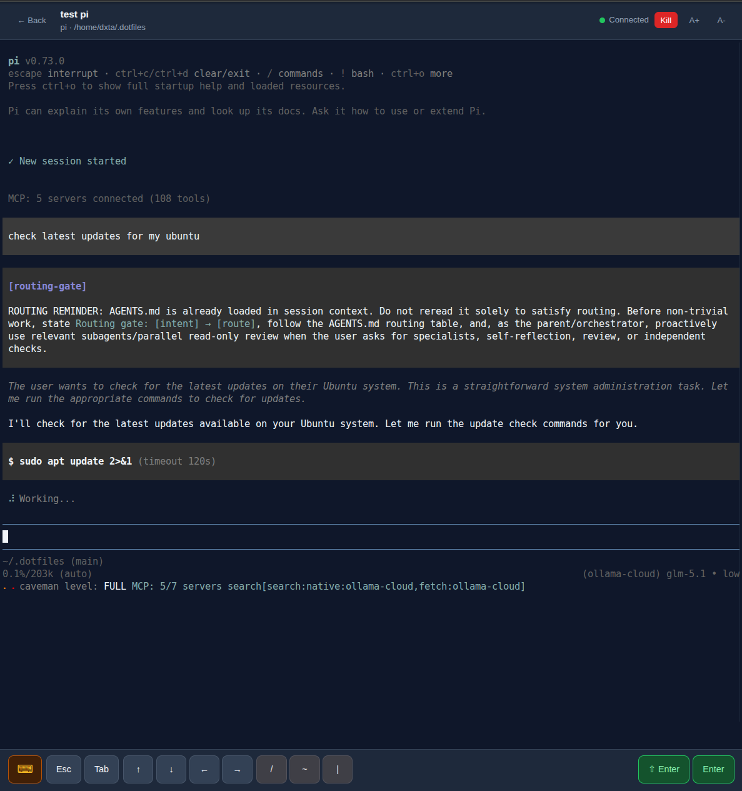

# TUI Serve Manager

Run and resume coding-agent terminals from any browser.



TUI Serve is a lightweight web UI for long-running coding-agent sessions on Linux, WSL, and macOS. It gives you browser-based terminal access backed by tmux, so sessions survive disconnects, browser reloads, and daemon restarts.

## Features

- **Browser terminal** for Pi, Claude, Codex, OpenCode, and potentially other CLI agents
- **Persistent sessions** backed by tmux
- **Resume after disconnects** from desktop or mobile
- **Mobile-friendly PWA** for quick checks away from keyboard
- **Private-network friendly** for localhost, LAN, VPN, and Tailscale setups

## Installation

### Supported platforms

| Platform | Status | Install |
|---|---|---|
| Debian / Ubuntu | Supported | `.deb` package |
| macOS | Not yet tested | macOS release artifact |
| WSL2 | Not yet tested | Linux package or source |

### Requirements

- Node.js 22 LTS
- tmux
- native build tools for `node-pty`
  - Linux: `build-essential python3 make g++`
  - macOS: Xcode command line tools

### Linux

Install the `.deb` release artifact, then enable the per-user service:

```bash
sudo apt install ./tui-serve_<version>_<arch>.deb
/usr/share/doc/tui-serve/install-user-service.sh
systemctl --user status tui-serve
```

Open `http://<host>:5555` and enter your auth token.

### macOS (Not yet Tested)

macOS is expected to be supported, but has not been fully tested.

Install the macOS release artifact, then run the bundled installer:

```bash
tar xzf tui-serve-<version>-macos-arm64.tar.gz
cd tui-serve-<version>
./deploy/scripts/install-macos.sh
```

Run diagnostics if needed:

```bash
/usr/local/opt/tui-serve/deploy/scripts/doctor-macos.sh
```

### From source

Use source install for development or unreleased platforms:

```bash
cd tui-serve
npm install
npm run build
rm -rf web/dist && mkdir -p web && cp -R tui-web/dist web/dist
cd server
AUTH_TOKEN=replace-with-a-long-random-token PORT=5555 NODE_ENV=production npm start
```

## Quick start

1. Open `http://localhost:5555` or `http://<host>:5555`.
2. Enter the configured auth token.
3. Create a session with a command ID and working directory.
4. Attach from any browser.
5. Disconnect freely; tmux keeps the agent running.

## Development

```bash
cd tui-serve
npm install

cd server
cp .env.example .env
# edit AUTH_TOKEN if needed

cd ..
npm run dev
```

Dev defaults:

| Component | Default |
|---|---|
| Backend | `http://localhost:3100` |
| Frontend | `http://localhost:5173` |
| Production | `http://localhost:5555` |

## Configuration

| Setting | Default | Description |
|---|---:|---|
| `AUTH_TOKEN` | empty/local or configured by package | Bearer token for API and WebSocket access |
| `PORT` | `5555` | Server listen port |
| `BIND_HOST` | `127.0.0.1` or package default | Listen address |
| `commands[].allowedCwdRoots` | `$HOME`, `/tmp` depending on install | Allowed session working-directory roots |

Commands are configured by ID. Clients send `commandId` such as `pi`, `claude`, `codex`, or `opencode`; raw commands are not accepted from clients.

## Security

Treat TUI Serve access as shell access for the service user.

- Use localhost, SSH tunnels, trusted LAN, VPN, or Tailscale.
- Do **not** expose plain HTTP directly to the public internet.
- Use HTTPS or an identity-aware reverse proxy on shared/untrusted networks.
- Keep `AUTH_TOKEN` long and random for network-reachable binds.
- Restrict commands and working directories with allowlists.

Read the full [Security Guide](docs/security.md).

## Architecture

```text
Browser PWA + xterm.js
    ⇅ REST + WebSocket
Node/Fastify daemon
    ⇅ node-pty / tmux attach-session
tmux sessions running coding agents
```

- One daemon serves API, WebSocket, and built frontend assets.
- tmux owns long-running agent processes.
- Browser viewers can attach, detach, and resume without killing sessions.

## Documentation

- [API reference](docs/api.md)
- [Security Guide](docs/security.md)
